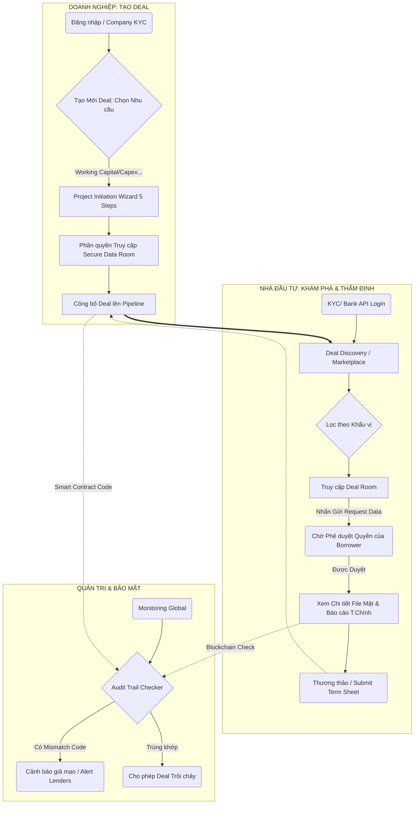

# 06. Product Flow & Architecture (Matcha Capital)

Đặc tả luồng trải nghiệm tổng quát và kiến trúc vận hành của ứng dụng **Matcha Capital (Capital Infrastructure Platform)**.

## I. Yêu cầu Hệ thống / Mục tiêu Giải pháp
Platform sinh ra để giải quyết nhu cầu ghép nối dòng chảy Vốn và Nhu cầu huy động qua lớp lưới Thẩm định (Due Diligence). Cấu trúc của nền tảng dựa trên 3 Role (phân quyền) lớn:
1.  **Internal Role (Borrower / Công ty Cần vốn - VD: DRG)**: Đóng vai trò là Tác giả của Hồ sơ Dự án, làm chủ hệ thống kho lưu trữ Dữ liệu Mật (VDR).
2.  **Lender Role (Investor / Tổ chức Cấp vốn)**: Đi tìm deal đầu tư hoàn chỉnh, xem hồ sơ, đàm phán tỷ lệ % và Ra quyết định (Termsheet).
3.  **Admin Role (Matcha System Admin & Blockchain Nodes)**: Quản trị, đối chiếu mã băm tài liệu, điều phối Marketplace và ngăn chặn gian lận hồ sơ.

## II. Sơ đồ Luồng Tổng quát (High-level User Flow)

## III. Tóm tắt Triển khai Giai đoạn Prototype (17 Screens)
Trong nội vi Prototype tĩnh, toàn bộ luồng User Flow được thiết kế dựa trên HTML/CSS/JS cục bộ với việc lưu trạng thái `role` (Internal/Lender/Admin) qua `localStorage` tại màn hình Login. Thanh điều hướng dọc (Sidebar) là yếu tố Backbone liên kết 17 Modules chức năng khác nhau vào một Workflow sống động giúp thể hiện đầy đủ Value Proposition trên bản vẽ này.
